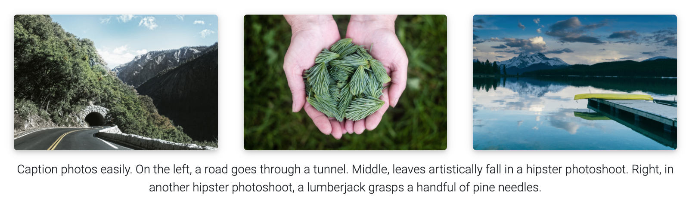

# My portfolio website

This is the repository for my portfolio website, which is based off of the [**al-folio**](https://github.com/alshedivat/al-folio) template.
Some of their original documentation is included below, but you can find their full README in the original repo.

# al-folio

**Note**: some of the original content of the README is omitted for brevity.
Please view the original README on the [al-folio github repo](https://github.com/alshedivat/al-folio).

## Table Of Contents

- [Getting started](#getting-started)
- [Installing and Deploying](#installing-and-deploying)
- [Customising](#customising)
- [Features](#features)
   - [Light/Dark Mode](#lightdark-mode)
   - [CV](#cv)
   - [Publications](#publications)
   - [Layouts](#layouts)
      - [The iconic style of Distill](#the-iconic-style-of-distill)
      - [Full support for math \& code](#full-support-for-math--code)
      - [Photos, Audio, Video and more](#photos-audio-video-and-more)
    - [Other features](#other-features)
      - [Theming](#theming)
      - [Related posts](#related-posts)
      - [Code quality checks](#code-quality-checks)
  - [FAQ](#faq)
  - [License](#license)

## Getting started

Want to learn more about Jekyll? Check out [this tutorial](https://www.taniarascia.com/make-a-static-website-with-jekyll/). Why Jekyll? Read [Andrej Karpathy's blog post](https://karpathy.github.io/2014/07/01/switching-to-jekyll/)! Why write a blog? Read [Rachel Thomas blog post](https://medium.com/@racheltho/why-you-yes-you-should-blog-7d2544ac1045).

## Installing and Deploying

For installation and deployment details please refer to [INSTALL.md](INSTALL.md).

## Customising

For customisation details please refer to [CUSTOMIZE.md](CUSTOMIZE.md).

## Features

### Light/Dark Mode

This template has a built-in light/dark mode. It detects the user preferred color scheme and automatically switches to it. You can also manually switch between light and dark mode by clicking on the sun/moon icon in the top right corner of the page.

---

### CV

There are currently 2 different ways of generating the CV page content. The first one is by using a json file located in [assets/json/resume.json](assets/json/resume.json). It is a [known standard](https://jsonresume.org/) for creating a CV programmatically. The second one, currently used as a fallback when the json file is not found, is by using a yml file located in [\_data/cv.yml](_data/cv.yml). This was the original way of creating the CV page content and since it is more human readable than a json file we decided to keep it as an option.

What this means is, if there is no resume data defined in [\_config.yml](_config.yml) and loaded via a json file, it will load the contents of [\_data/cv.yml](_data/cv.yml) as fallback.

---

### Publications

Your publications' page is generated automatically from your BibTex bibliography. Simply edit [\_bibliography/papers.bib](_bibliography/papers.bib). You can also add new `*.bib` files and customize the look of your publications however you like by editing [\_pages/publications.md](_pages/publications.md). By default, the publications will be sorted by year and the most recent will be displayed first. You can change this behavior and more in the `Jekyll Scholar` section in [\_config.yml](_config.yml) file.

You can add extra information to a publication, like a PDF file in the [assets/pdf/](assets/pdf/) directory and add the path to the PDF file in the BibTeX entry with the `pdf` field. Some of the supported fields are: `abstract`, `altmetric`, `arxiv`, `bibtex_show`, `blog`, `code`, `dimensions`, `doi`, `eprint`, `html`, `isbn`, `pdf`, `pmid`, `poster`, `slides`, `supp`, `video`, and `website`.

---

### Layouts

**al-folio** comes with stylish layouts for pages and blog posts.

#### The iconic style of Distill

The theme allows you to create blog posts in the [distill.pub](https://distill.pub/) style:

For more details on how to create distill-styled posts using `<d-*>` tags, please refer to [the example](https://alshedivat.github.io/al-folio/blog/2021/distill/).

#### Full support for math & code

**al-folio** supports fast math typesetting through [MathJax](https://www.mathjax.org/) and code syntax highlighting using [GitHub style](https://github.com/jwarby/jekyll-pygments-themes). Also supports [chartjs charts](https://www.chartjs.org/), [mermaid diagrams](https://mermaid-js.github.io/mermaid/#/), and [TikZ figures](https://tikzjax.com/).

#### Photos, Audio, Video and more

Photo formatting is made simple using [Bootstrap's grid system](https://getbootstrap.com/docs/4.4/layout/grid/). Easily create beautiful grids within your blog posts and project pages, also with support for [video](https://alshedivat.github.io/al-folio/blog/2023/videos/) and [audio](https://alshedivat.github.io/al-folio/blog/2023/audios/) embeds:

  

---

### Other features

#### Theming

A variety of beautiful theme colors have been selected for you to choose from. The default is purple, but you can quickly change it by editing the `--global-theme-color` variable in the `_sass/_themes.scss` file. Other color variables are listed there as well. The stock theme color options available can be found at [\_sass/\_variables.scss](_sass/_variables.scss). You can also add your own colors to this file assigning each a name for ease of use across the template.

---

#### Social media previews

**al-folio** supports preview images on social media. To enable this functionality you will need to set `serve_og_meta` to `true` in your [\_config.yml](_config.yml). Once you have done so, all your site's pages will include Open Graph data in the HTML head element.

You will then need to configure what image to display in your site's social media previews. This can be configured on a per-page basis, by setting the `og_image` page variable. If for an individual page this variable is not set, then the theme will fall back to a site-wide `og_image` variable, configurable in your [\_config.yml](_config.yml). In both the page-specific and site-wide cases, the `og_image` variable needs to hold the URL for the image you wish to display in social media previews.

---

#### Related posts

By default, there will be a related posts section on the bottom of the blog posts. These are generated by selecting the `max_related` most recent posts that share at least `min_common_tags` tags with the current post. If you do not want to display related posts on a specific post, simply add `related_posts: false` to the front matter of the post. If you want to disable it for all posts, simply set `enabled` to false in the `related_blog_posts` section in [\_config.yml](_config.yml).

---

#### Code quality checks

Currently, we run some checks to ensure that the code quality and generated site are good. The checks are done using GitHub Actions and the following tools:

- [Prettier](https://prettier.io/) - check if the formatting of the code follows the style guide
- [lychee](https://lychee.cli.rs/) - check for broken links
- [Axe](https://github.com/dequelabs/axe-core) (need to run manually) - do some accessibility testing

We decided to keep `Axe` runs manual because fixing the issues are not straightforward and might be hard for people without web development knowledge.

## FAQ

For frequently asked questions, please refer to [FAQ.md](FAQ.md).

## License

The theme is available as open source under the terms of the [MIT License](https://github.com/alshedivat/al-folio/blob/master/LICENSE).

Originally, **al-folio** was based on the [\*folio theme](https://github.com/bogoli/-folio) (published by [Lia Bogoev](https://liabogoev.com) and under the MIT license). Since then, it got a full re-write of the styles and many additional cool features.
